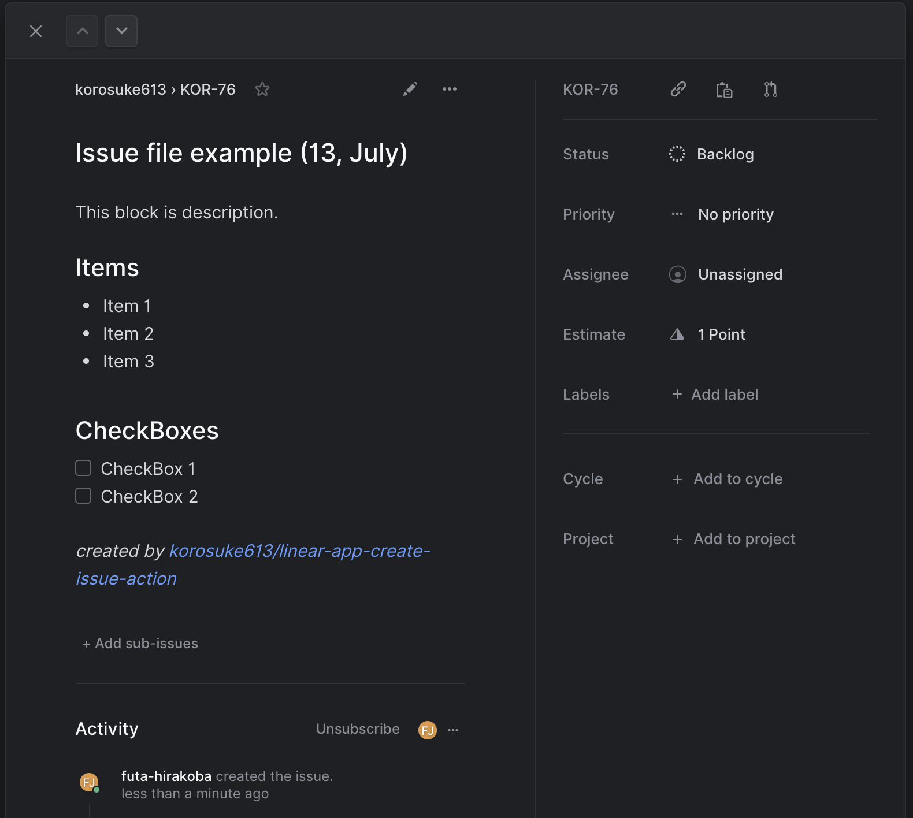

# linear-app-create-issue-action

GitHub Action to create an Issue for [Linear.app](https://linear.app/).

[](https://github.com/Penneo/linear-app-create-issue-action/actions/workflows/ci.yml)

## Usage

### Input
See [action.yml](./action.yml)

|arg|description|required|type|
|---|---|---|---|
|issueFilePath|File path of Issue markdown|yes|string|
|apiKey|api key of Linear.app ([ref](https://developers.linear.app/docs/graphql/working-with-the-graphql-api#personal-api-keys))|yes|string|
|teamId|team id of Linear.app ([ref](#faq-get-teamid-stateid))|yes|string|
|stateId|state id of Linear.app ([ref](#faq-get-teamid-stateid))|yes|string|
|isDryrun|enable dryrun (not create issue) |no|boolean|
|embed|variables to embed into the yaml block. (ex: "month=July,day=13,labelIds=\"ID-1,ID-2\"")|no|string or comma separated strings|

## Usage

### Create Issue file
Create issue file in markdown format. Write the contents of [IssueCreateInput](https://github.com/linear/linear/blob/8553690da1455e2f6a109bed65223bc5400fa7c2/packages/sdk/src/schema.graphql#L2021) in YAML format on the line enclosed by ---. title is required.

If you want to change the value of YAML dynamically, you can replace `${something}` when executing the action.

[example-issue.md](./example/example-issue.md)
```markdown
---
title: Issue file example (${day}, ${month}) # title is required
labelIds: ${labelIds}
estimate: 1
---
This block is description.

## Items
* Item 1
* Item 2
* Item 3

## CheckBoxes
- [ ] CheckBox 1
- [ ] CheckBox 2

*created by [Penneo/linear-app-create-issue-action](https://github.com/Penneo/linear-app-create-issue-action)*
```

### Create Workflow
Create a workflow `.yml` file in your repositories `.github/workflows` directory. An example workflow is available below. For more information, reference the GitHub Help Documentation for [Creating a workflow file](https://help.github.com/en/articles/configuring-a-workflow#creating-a-workflow-file).

If you want to replace ${something} in YAML, use `embed` with `key1=value1,key2=value2,...`.

[create-issue-every-friday.yml](example/create-issue-every-friday.yml)
```yaml
name: Create Issue every friday
on:
  schedule:
    - cron: "0 8 * * 5"  # At 08:00 on Friday (UTC).

jobs:
  create-issue:
    runs-on: ubuntu-latest
    steps:
      - uses: penneo/linear-app-create-issue-action@v1
        with:
          issueFilePath: "./example/example-issue.md"
          apiKey: ${{ secrets.YOUR_API_TOKEN_OF_LINEAR_APP }}
          teamId: ${{ secrets.YOUR_TEAM_ID_OF_LINEAR_APP }}
          stateId: ${{ secrets.YOUR_STATE_ID_OF_LINEAR_APP }}
          embed: month=July,day=13,labelIds="${{ secrets.LINEAR_AUTOMATION_LABEL_ID }}, ${{ secrets.LINEAR_MAINTENANCE_LABEL_ID }}"
```

**result**


## FAQ

<a name="faq-get-teamid-stateid"></a>
### How do I get teamId and stateId?
Call the Linear API. An example is shown below.

#### teamId

input

```shell
curl \
  -X POST \
  -H "Content-Type: application/json" \
  -H "Authorization: <Replace this with your Linear API Key>" \
  --data '{ "query": "{ teams { nodes { id name } } }" }' \
  https://api.linear.app/graphql | jq
```

output

```json
{
  "data": {
    "teams": {
      "nodes": [
        {
          "id": "eeaa0cbd-xxxx-xxxx-xxxx-1c701c3485f1",
          "name": "korosuke613"
        }
      ]
    }
  }
}
```

#### stateId

input

```shell
curl \
  -X POST \
  -H "Content-Type: application/json" \
  -H "Authorization: <Replace this with your Linear API Key>" \
  --data '{ "query": "{ workflowStates { nodes { id name type } } }" }' \
  https://api.linear.app/graphql | jq
```

output

```json5
{
  "data": {
    "workflowStates": {
      "nodes": [
        {
          "id": "76984209-xxxx-xxxx-xxxx-78eb458a7cbe",
          "name": "In Review",
          "type": "started"
        },
        {
          "id": "e788ada6-xxxx-xxxx-xxxx-5717c26104ad",
          "name": "Todo",
          "type": "unstarted"
        },
        {
          "id": "c02edc3a-xxxx-xxxx-xxxx-85c349766a13",
          "name": "Backlog",
          "type": "backlog"
        },
        // etc..
      ]
    }
  }
}
```

## License
The scripts and documentation in this project are released under the [MIT License](LICENSE)
